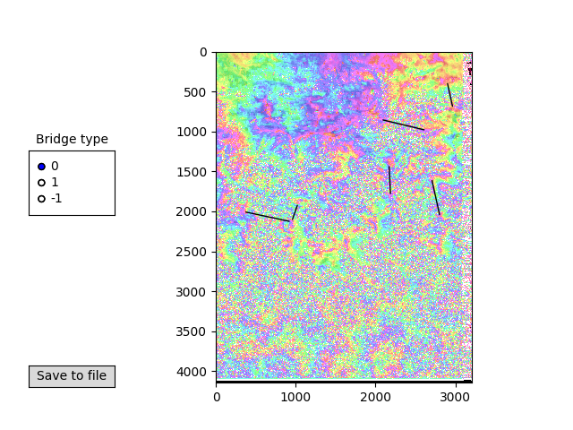

Load of tools to the NSBAS processing chain and FLATSIM products (https://flatsim.cnes.fr/doi/?lang=fr) 

add\_r4.py /add\_rmg.py
============
Add, substract, compute the amplitude (```infile1**2,infile2**2```) ar the phase (```arctan(infile1/infile2```)) from two real4 files.
Add, substract, and plot RMG (BIL) unwrapped files.

bridge.py / plot_bridges.py
============
Create bridge.in file given output form mdx written in a text file.To create the text file: right clic on the two points to bridge on mdx windows and copy past terminal in a text file
Plot bridges   



check\_coverage\_unw.py 
============
Check coverage or empty unwrapped ifgs

check\_event.py
============
Check for event date in YYYYMMDD format in a list of ifgs

remove\_from\_list.py
============
remove ifgs from a list given another list

remove\_small\_baselines.py
============
Remove small baseline ifgs from a pair list file

rmg2grd.py
============
Convert raster file in rmg format to NetCDF format

clean\_slc.py
============
Clean NSBAS slc directory before running them again

count\_unw\_pixel.py
========================
This script count the number of unw pixels for qll ifgs with a given temporal baselines thresholds 

cpx2rmg.py
========================
Convert raster file from complex to rmg format


clean\_raster.py
============
Clean a real4 file given an other real4 file (mask) and a threshold on this mask

cut\_r4.py / cut\_rmg.py / cut_int.r4
============
Crop r4 file, RMG (BIL) or CPX files

dem2slope.py
============
Convert dem to slope file in the LOS geeometry knowing mean LOS heading and latitudes.

extend\_r4.py
============
Extend real4 file to new number of lines and columns

histo\_r4.py
============
Compute histogram distribution of a real4 file

invert\_phi.py
============
Time series inversion of given parameters: solve phase/noise/spectrum for each acquisition dates using phase/noise/spectrum of all interferograms such as phi(AB) = phi(B) - phi(A) or sigma(AB)^2 = sigma(A)^2 + sigma(B)^2

ll\_to\_radar.py
============
Transform a list of geographic coordinates into radar corrdinates

mask\_unw.py
============
Mask unwrapped interferogram (BIL format) given a mask file in real4 format. 

plot\_RMS\_ts.py
============
Create jpg for all RMS files output from time series analysis

preview\_slc.py / preview\_unw.py / preview\_rawslc.py / preview\_int.py
============
Script to create jpg for all SCL or Ifgs


