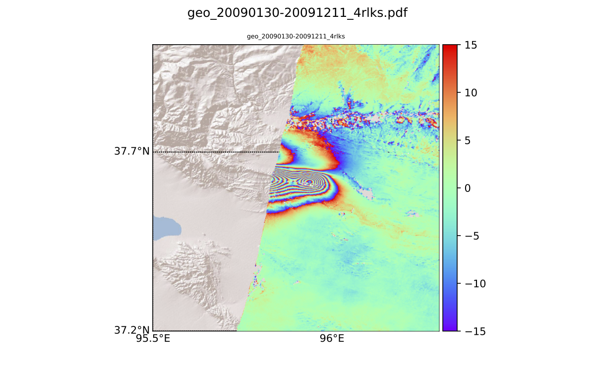

plot\_geo.py
============
Plot georeferenced file in RMG or Tif format with optional DEM or ARCGISIMAGE with additional cropping, conversion options

```
Usage: plot_geo.py -h | --help

```



plot\_raster.py
============
Plot raster file 

```
Usage: plot_raster.py -h | --help
plot\_raster.py
-------------
Display and Cut image file (.unw/.int/.r4/.tiff)

Usage: plot\_raster.py --infile=<path> [--cpt=<values>] [<ibeg>] [<iend>] [<jbeg>] [<jend>] [--format=<value>] [--lectfile=<value>] [--rad2mm=<value>] [--title=<value>] [--wrap=<values>] [--band=<values>]
       plot\_raster.py --infile=<path> [--cpt=<values>] [<ibeg>] [<iend>] [<jbeg>] [<jend>] [--format=<value>] [--parfile=<path>] [--lectfile=<value>] [--rad2mm=<value>] [--title=<value>] [--wrap=<values>] [--vmin=<value>] [--vmax=<value>] [--cols=<values>] [--lines=<values>] [--band=<values>]
       plot\_raster.py --infile=<path> [--cpt=<values>] [--crop=<values>] [--format=<value>] [--lectfile=<value>] [--rad2mm=<value>] [--title=<value>] [--wrap=<values>] [--vmin=<value>] [--vmax=<value>] [--band=<values>]


Options:
-h --help             Show this screen.
--infile=<file>       Raster to be displayed
--ibeg=<value>        Ligne numbers bounded the cutting zone [default: 0]
--iend=<value>        Ligne numbers bounded the cutting zone [default: nlines]
--jbeg=<value>        Column numbers bounded the cutting zone [default: 0]
--jend=<value>        Column numbers bounded the cutting zone [default: ncols]
--crop=<values>          Crop option with smoothing of boundaries (same as ibeg,iend..) [default: 0,ncols,0,nlines]
--format=<value>      Format input files: ROI_PAC, GAMMA, GTIFF [default: ROI_PAC]
--cpt==<value>        Indicate colorscale for phase
--wrap=<value>        Wrapped phase between value for unwrapped files
--lectfile=<file>     Path of the lect.in file for r4 format
--parfile=<file>      Path of the .par file of GAMMA
--rad2mm=<value>      Convert data [default: 1]
--tile=<value>        Title plot
--band=<values>      Select band number [default: 1]
--vmax                Max colorscale [default: 98th percentile]
--vmin                Min colorscale [default: 2th percentile]
--cols VALUE         Add crosses on pixel column numbers (eg. 200,400,450)
--lines VALUE        Add crosses on pixel lines numbers  (eg. 1200,1200,3000)
```

plot\_profile.py
============
Plot profiles for r4 files (velocity file ,APS file) given a strike, an origin and the size of the profile

```
Usage: plot_profile.py -h | --help
```


